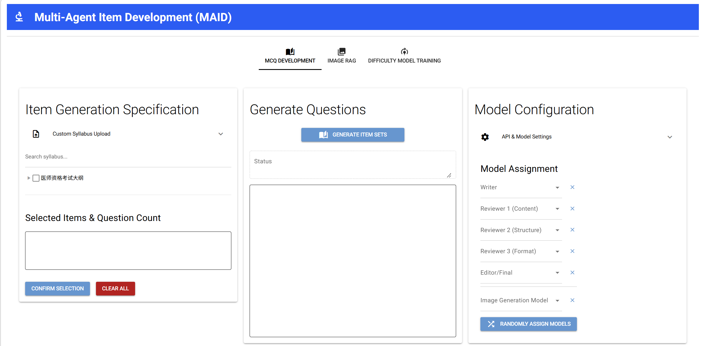

# Multi-Agent Item Development (MAID) Platform

An advanced AI-powered medical examination question generation and difficulty prediction platform with integrated Image RAG capabilities.



## Features

### 1. **Question Generation System**
- **Multi-agent Workflow**: Utilizes AI agents for different roles (Question Writer, Multiple Reviewers, Editor)
- **Multiple Question Types**: Supports A1 (knowledge-based) and A2 (case analysis) question types
- **Image Integration**: Can generate or retrieve relevant medical images for questions
- **Interactive Editing**: Built-in chat interface for refining generated questions
- **Professional Medical Focus**: Tailored for clinical practitioner qualification examinations

### 2. **Difficulty Prediction System**
- **Multiple Feature Methods**: TF-IDF and Sentence Embeddings
- **Advanced Models**: Supports RandomForest and XGBoost with hyperparameter tuning
- **Statistical Features**: Character count, word count, sentence count, average word length
- **Batch Processing**: Predict difficulty for multiple questions at once
- **RESTful API**: Easy integration with external systems

### 3. **Image RAG Module** (NEW!)
- **FAISS-powered Search**: Efficient vector-based image retrieval
- **Flexible Indexing**: Upload and index medical images with descriptions
- **Smart Integration**: Automatically includes relevant images in question generation
- **Sentence Transformers**: High-quality text embeddings for semantic search

### 4. **User-Friendly Interface**
- **NiceGUI-based UI**: Modern, responsive web interface
- **Real-time Progress**: Visual feedback during question generation
- **Model Management**: Configure multiple AI models with ease
- **Export Options**: Download questions as DOCX files with or without answers

## Installation

### Prerequisites
- Python 3.9 or higher
- pip package manager

### Step 1: Clone or Download Project
```bash
cd MAID-Platform
```

### Step 2: Install Dependencies

Using domestic mirror (recommended for Chinese users):
```bash
pip install -r requirements.txt -i https://pypi.tuna.tsinghua.edu.cn/simple
```

Or using standard PyPI:
```bash
pip install -r requirements.txt
```

### Step 3: Verify Installation
```bash
python multi_agent_dev.py
```

The application will start and display a URL (usually http://localhost:8080) in your terminal.

## Dependencies

### Core Dependencies
- `nicegui>=3.9.0` - Web UI framework
- `fastapi>=0.129.0` - Web framework for API
- `pandas>=2.0.0` - Data manipulation
- `numpy>=1.24.0` - Numerical computing
- `scikit-learn>=1.7.0` - Machine learning
- `xgboost>=3.2.0` - Gradient boosting
- `sentence-transformers>=5.3.0` - Text embeddings
- `openai>=1.0.0` - OpenAI API client
- `langchain-nvidia-ai-endpoints>=1.0.0` - NVIDIA-hosted model client
- `python-docx>=1.0.0` - DOCX file generation

### Image RAG Dependencies (NEW!)
- `faiss-cpu>=1.7.0` - Vector similarity search (or `faiss-gpu` for GPU acceleration)
- `Pillow>=10.0.0` - Image processing

### Additional Dependencies
- `httpx>=0.28.0` - Async HTTP client
- `pydantic>=2.12.0` - Data validation
- `uvicorn>=0.41.0` - ASGI server

## Usage

### Starting the Application
```bash
python multi_agent_dev.py
```

The application will be available at http://localhost:8080

#### Windows One-Click Start

Double-click `start_maid_windows.bat`. The launcher uses the default `python`
environment from `PATH`, enables pip when necessary, and installs missing
dependencies from the official PyPI index. It then starts MAID in a hidden
background process, waits for port 8080 to become ready, and opens the UI in the
default browser.

Runtime output is written to `maid_server.log` and errors are written to
`maid_server_error.log`. The background process ID is stored in
`maid_server.pid`. Re-running the launcher while port 8080 is already active
opens the existing UI instead of starting another server.

### Configuring AI Models

1. Navigate to **"Model Configuration"** section
2. Click **"API and Model Settings"**
3. Enter model details:
   - **Display Name**: Name shown in role selectors (e.g., "GPT-4")
   - **Provider**: `openai` or `nvidia`
   - **Model ID**: Provider model identifier (e.g., `openai/gpt-oss-120b`)
   - **API Key**: Your OpenAI API key
   - **Base URL**: API endpoint (if using a custom endpoint)
   - **Model Type**: Select "Text Output", "Image Generation", or "Multimodal"
4. Click **"Save Configuration"**

Alternatively, load preset configurations by entering the preset password.

### NVIDIA Demo Models

MAID includes a rate-limited NVIDIA API key for reviewer demonstrations, so
**Fill with Demo LLMs** works without local configuration. To use your own key,
set `NVIDIA_API_KEY` before starting MAID; the environment variable overrides
the bundled demo credential. PowerShell example:

```powershell
$env:NVIDIA_API_KEY="nvapi-your-key-here"
python multi_agent_dev.py
```

In **Model Configuration**, click **Fill with Demo LLMs**. MAID tests every
bundled NVIDIA candidate for the current session, keeps only models that return
a valid response, and randomly assigns the healthy models to Writer, Reviewers,
and Editor. A failed or unavailable model does not prevent the other models from
being loaded. The API key is read from the process environment and is not stored
in the repository.

### Question Generation Workflow

1. **Select Syllabus Items**: 
    - Browse the hierarchical curriculum tree
    - Check the checkboxes for desired items
    - Set the number of questions for each item

2. **Configure Models**:
   - Assign models to each role (Writer, Reviewers, Editor)
   - Optionally select an image generation model

3. **Generate Questions**:
    - Click **"Generate Item Sets"**
    - Monitor progress in real-time
    - Review generated questions in the preview area

4. **Edit Questions** (Optional):
   - Click on any question card to open the editing dialog
   - Use the chat interface to request modifications
   - Regenerate images if needed
   - Save changes

5. **Export**:
    - Download as **"Item Set (DOCX)"** (questions only, no answers)
    - Download as **"Full Set with Answers (DOCX)"** (with answers and explanations)
    - Download the **"Generation Log"** for review

### Custom Syllabus Upload

MAID includes two built-in curricula that can be selected above the syllabus
tree:

- **USMLE Step 1 (English)**, organized by foundational sciences, organ systems,
  biostatistics, epidemiology, and ethics.
- **Chinese Medical Licensing Examination (Chinese)**, preserving the original
  Chinese curriculum included with MAID.

You can replace either built-in tree for the current session by uploading your
own syllabus outline in **Markdown format**.

#### Markdown Format

Use standard Markdown headings (`#`, `##`, `###`, etc.) to define the hierarchy. Use bullet lists (`-` or `*`) for selectable leaf nodes (the actual syllabus items).

Example:

```markdown
# Clinical Medicine
## Internal Medicine
### Respiratory Diseases
- Chronic Obstructive Pulmonary Disease
- Bronchial Asthma
- Pneumonia
- Pulmonary Tuberculosis
### Cardiovascular Diseases
- Hypertension
- Coronary Heart Disease
- Heart Failure
## Surgery
### General Surgery
- Acute Appendicitis
- Inguinal Hernia
### Orthopedics
- Fractures
- Joint Dislocations
## Pediatrics
### Neonatal Diseases
- Neonatal Asphyxia
- Neonatal Jaundice
```

#### Rules

| Element | Purpose | Example |
|---------|---------|---------|
| `# Heading` | Top-level category (not selectable) | `# Clinical Medicine` |
| `## Heading` | Sub-category (not selectable) | `## Internal Medicine` |
| `### Heading` | Sub-section (not selectable) | `### Respiratory Diseases` |
| `- Item` | Selectable syllabus item (leaf node) | `- COPD` |

- Headings create the tree structure; only the **lowest-level bullet items** are selectable.
- You can use up to 6 heading levels (`#` through `######`).
- Bullet items (`-` or `*`) under a heading become the tickable leaf nodes.
- The file must be encoded in **UTF-8**.

#### How to Upload

1. In the **MCQ Development** tab, find the **"Item Generation Specification"** panel on the left.
2. Expand the **"Custom Syllabus Upload"** section.
3. Drag and drop your `.md` file (or click to browse).
4. The syllabus tree will update automatically to reflect your custom outline.
5. Select items and set question counts as usual.
6. Click **"Reset Current Syllabus"** to restore the currently selected built-in curriculum.

### Difficulty Prediction

#### 1. Data Upload
- Upload a CSV or Excel file containing question data
- Map columns to required fields (stem, options, answer, difficulty)
- Preview the uploaded data

#### 2. Preprocessing
- Select preprocessing options (lowercase, punctuation removal)
- Configure column mappings

#### 3. Feature Engineering
- Choose the feature extraction method:
  - **TF-IDF**: Traditional bag-of-words approach
  - **Sentence Embeddings**: Pre-trained transformer models
- Add statistical features (character count, word count, etc.)

#### 4. Model Training
- Select the model type (RandomForest or XGBoost)
- Set the train/test split ratio
- Enable hyperparameter tuning (XGBoost only)
- Train the model and view the validation results

#### 5. Prediction
- **Single Question**: Enter the question text directly
- **Batch Prediction**: Upload a file with multiple questions
- Export the predictions as CSV

### Using the Image RAG Module

#### 1. Setting Up Image RAG

**Prerequisites**:
- Install FAISS: `pip install faiss-cpu` (or `faiss-gpu` for GPU)

**Initial Setup**:
1. Navigate to the **"Image RAG"** tab
2. Check the database status at the top
3. Select an embedding model for RAG (default: `shibing624/text2vec-base-chinese`)

#### 2. Indexing Images

**Upload and Index**:
1. Upload medical images (JPG, PNG, etc.) using the file uploader
2. Enter descriptions for each image (one per line, in the order of upload)
3. Click **"Index Images"** to add them to the RAG database
4. Monitor the indexing progress and success/failure count

**Best Practices**:
- Use clear, descriptive text for image descriptions
- Include relevant medical terminology
- Maintain consistency in the description format
- Group related images together

#### 3. Searching Images

**Manual Search**:
1. Enter a search query in the search box
2. Click **"Search"** to find similar images
3. Review the results sorted by similarity (distance)
4. View image previews and descriptions

**Automatic Integration**:
1. Enable the **"Enable RAG for Question Generation"** switch
2. During question generation, the system will automatically:
   - Search for relevant images based on the question topic
   - Include the top results in the prompt
   - Allow the AI to select or reference these images

**Advanced Usage**:
- Use specific medical terms in search queries
- Combine multiple concepts (e.g., "ECG myocardial infarction anterior")
- Refine searches by adding more context
- Use search results to discover related medical imagery

#### 4. Managing the Database

**View Statistics**:
- Total number of indexed images
- Database status (enabled/disabled)
- Embedding dimension

**Clear Database**:
- Click **"Clear Database"** to remove all indexed images
- Useful for starting fresh or for testing

**Troubleshooting**:
- If images don't appear in search: Check that descriptions were indexed properly
- If search is slow: Consider using GPU with `faiss-gpu`
- If database shows disabled: Ensure FAISS is installed

### API Integration

#### Check Model Status
```bash
curl http://localhost:8080/api/status
```

Response:
```json
{
  "model_trained": true,
  "feature_method": "embedding",
  "sentence_model_name": "shibing624/text2vec-base-chinese",
  "timestamp": 1678886400.0
}
```

#### Predict Question Difficulty
```bash
curl -X POST http://localhost:8080/api/predict \
  -H "Content-Type: application/json" \
  -d '{
    "items": [
      {
        "stem": "Question text here...",
        "options": {
          "A": "Option A",
          "B": "Option B"
        },
        "answer": "Option A"
      }
    ]
  }'
```

Response:
```json
{
  "predictions": [0.6279140117645264],
  "model_info": "Model: RandomForestRegressor, Features: embedding"
}
```

## Project Structure

```
MAID-Platform/
├── multi_agent_dev.py          # Main application file
├── requirements.txt            # Python dependencies
├── README.md                   # This file
├── mcq_outputs/                # Generated output directory
│   ├── ExamRun_YYYYMMDD_HHMMSS/
│   │   ├── item_set_complete_YYYYMMDD_HHMMSS.docx
│   │   ├── item_set_questions_YYYYMMDD_HHMMSS.docx
│   │   ├── generation_summary_log.txt
│   │   └── individual_mcq_reports/
│   │       ├── mcq_1_report.html
│   │       └── ...
│   ├── generated_images/       # Generated/Uploaded images
│   └── image_rag/              # Image RAG database
│       ├── image_rag_index.faiss
│       └── image_rag_metadata.pkl
└── selection_logs/             # Syllabus selection logs
```

## Architecture Overview

### Question Generation Pipeline
1. **Writer Agent**: Generates the initial draft based on the content specification
2. **Image Generation**: Creates or retrieves relevant medical images
3. **Review Agent 1**: Evaluates medical content and clinical relevance
4. **Review Agent 2**: Checks question structure and technical compliance
5. **Review Agent 3**: Reviews language clarity and formatting
6. **Editor Agent**: Synthesizes feedback and provides revision guidance
7. **Writer Revision**: Produces the final question incorporating all feedback
8. **Final Decision**: Editor makes the final approval decision

### Image RAG Workflow
1. **Indexing**:
   - Images are uploaded with descriptions
   - Sentence transformer creates embeddings
   - FAISS stores vectors for fast similarity search

2. **Search**:
   - Query is encoded with the same transformer
   - FAISS finds k-nearest neighbors
   - Results are returned with image paths and descriptions

3. **Integration**:
   - During question generation, the system searches for relevant images
   - Top results are included in AI prompts
   - The AI can reference or select images for inclusion

## Customization

### Adding Custom Question Templates
Edit the `EXAMPLE_ITEMS` variable in `multi_agent_item_dev.py` to define custom question formats.

### Modifying AI Prompts
All system prompts are defined in the `run_full_mcq_pipeline` function. Customize them to adjust the quality and style of generated questions.

### Extending the Knowledge Base

**Option A - Upload via UI**: Use the **Custom Syllabus Upload** expansion panel in the MCQ Development tab to upload a Markdown file (see [Custom Syllabus Upload](#custom-syllabus-upload) for format details).

**Option B - Edit the Code**: Modify the `SYLLABUS_DATA_HIERARCHICAL` dictionary in `multi_agent_dev.py` to add new curriculum topics permanently.

## Troubleshooting

### Common Issues

**1. ModuleNotFoundError: No module named 'xgboost'**
```bash
pip install xgboost -i https://pypi.tuna.tsinghua.edu.cn/simple
```

**2. FAISS not available for Image RAG**
```bash
pip install faiss-cpu -i https://pypi.tuna.tsinghua.edu.cn/simple
```

**3. OpenAI API errors**
- Verify the API key is correct
- Check that your account has sufficient credits
- Ensure the Base URL is correct (if using a custom endpoint)

**4. Image RAG search returns no results**
- Ensure images have been indexed successfully
- Check that descriptions are descriptive and relevant
- Try broader search terms

**5. Slow model training**
- Reduce the training data size
- Use TF-IDF instead of embeddings (faster)
- Disable hyperparameter tuning

### Performance Optimization

**For Question Generation**:
- Use faster models for review agents
- Reduce the number of review rounds
- Limit concurrent question generation

**For Difficulty Prediction**:
- Use TF-IDF features instead of embeddings
- Reduce the embedding dimension
- Use RandomForest instead of XGBoost

**For Image RAG**:
- Install `faiss-gpu` for GPU acceleration
- Limit the indexed images to the most relevant ones
- Use simpler embedding models

## Security Considerations

- **API Keys**: Never commit API keys to version control
- **File Uploads**: Validate all uploaded files
- **SQL Injection**: Use parameterized queries (if using a database)
- **XSS Prevention**: Sanitize user inputs in the UI
- **Rate Limiting**: Implement rate limiting for API endpoints

## Contributing

Contributions are welcome! Please follow these guidelines:

1. Fork the repository
2. Create a feature branch
3. Make your changes
4. Add tests if applicable
5. Submit a pull request

## License

This project is proprietary and confidential. All rights reserved.

## Support

For issues or questions:
- Check the troubleshooting section above
- Review the code comments in `multi_agent_dev.py`
- Contact the development team

## Acknowledgments

- **NiceGUI** for the excellent web framework
- **Sentence Transformers** for high-quality embeddings
- **FAISS** for efficient similarity search
- **OpenAI** for providing powerful AI models
- Medical education community for curriculum standards
